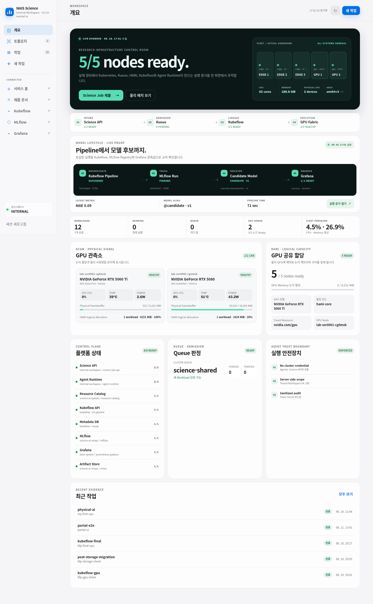

# mini-science-ai-os

`tenant-etri` 전용 내부 운영 제품인 NAIS Science Workspace입니다. 연구자는 Kubernetes Manifest 대신 웹 포털, Science Job API 또는 MCP를 사용합니다. Kueue가 입장·Quota를 결정하고, kube-scheduler/HAMi가 CPU·GPU 배치를 수행하며, Kubeflow Pipelines가 실행 이력·Metric·Artifact를 관리합니다.



대시보드는 데모 숫자를 표시하지 않습니다. 실제 5개 노드의 Kubernetes 상태, Kueue 입장 판정, HAMi 논리 할당, Prometheus 구성요소 상태와 DCGM 물리 GPU 신호를 `/v1/operations`에서 결합합니다. 화면의 시계열 값은 장비 상태에 따라 계속 바뀝니다.

## 현재 검증 상태

- PASS: Kubeflow Pipelines 2.17.0, Metadata, MySQL, MinIO Artifact 저장소 배포
- PASS: CPU Science Job → Kueue → Kubernetes Job → KFP Run/Metric/Artifact
- PASS: 두 GPU Job이 같은 물리 GPU UUID를 HAMi 1024MiB/10%씩 논리 할당받아 완료
- PASS: Quota 초과 Workload 대기 사유와 이후 입장
- PASS: MCP 자기 Job 제출·조회·취소와 Audit JSON
- PASS: ETRI 연구자 포털 자동 세션, Job 제출·조회·Metric·Artifact·취소, 데스크톱/모바일 UI
- PASS: 실제 5개 노드·2개 GPU의 Kueue/HAMi/Prometheus/DCGM 운영 대시보드
- PASS: KFP CPU Pipeline → MLflow 3.13 Run/Artifact/Model candidate → Grafana 라이브 상태
- PASS: ETRI 전용 Ingress, 2-replica API/MCP, PDB, Rate Limit·Security Header
- READY: `trusted-network` 내부 제품 모드와 `192.168.0.0/24` Ingress 접근 제한
- 운영 제약: Flannel NetworkPolicy 강제 여부와 Argo CD Git Sync는 별도 개선 항목

명령과 실제 출력은 [docs/evidence](docs/evidence), 기능별 판정은 [verification-matrix.md](docs/evidence/verification-matrix.md)에 보존합니다. HAMi의 논리 할당량은 GPU 성능 격리 보장이 아닙니다.

## 실행

이 프로젝트가 무엇인지 아주 쉽게 이해하려면 [EASY_EXPLAINER.md](EASY_EXPLAINER.md)를 먼저 읽으십시오. 연구 놀이터 이야기로 시작해 실제 기술 구조까지 연결합니다.

직접 하나씩 확인하려면 [GUIDEBOOK.md](GUIDEBOOK.md)를 따라가십시오. 조회, 포털 CPU/GPU Job, Kubeflow, MCP, 직접 API, 로컬 테스트와 정리 순서로 구성돼 있습니다.

NAIS 기술직-1 직무요건과 구현 증거의 대응, MLflow/Grafana 기능 실증, 복구·가용성 훈련,
10분 발표와 라이브 데모 동선은 [portfolio](portfolio)에 모았습니다.

```bash
make inventory
make validate
make bootstrap
CONFIRM_REMOVE_KIST=tenant-kist make etri-only
make release-check
make demo
make test
make portal
make portfolio-check
make recovery-plan
make resilience-plan
make destroy-demo
```

- `make inventory`: 읽기 전용 클러스터 조사
- `make validate`: Python·API·Kustomize·보안 정적 검사
- `make bootstrap`: Kueue와 Kubeflow, MinIO, Catalog, ETRI API/MCP를 idempotent 배포
- `make etri-only`: 소유권 Label 확인 후 프로젝트의 KIST Namespace와 KFP Launcher만 제거
- `make release-check`: 정적·라이브·제품 Endpoint Release Gate 실행
- `make status`: ETRI 제품 상태와 KIST 부재 확인
- `make demo`: CPU/GPU/Quota Demo 제출과 증거 기록
- `make test`: ETRI 최소권한 RBAC, API Session/Validation, KFP, MCP, Ingress 검증
- `make portal`: ETRI 포털을 `0.0.0.0:8090`에 임시 공개
- `make portfolio-check`: 기존 제품 테스트와 직무 증거 패키지의 정적·보안 검증
- `make recovery-plan`: 데이터 변경 없이 격리 Backup/Restore Drill 절차 출력
- `make resilience-plan`: Pod 변경 없이 PDB 기반 가용성 Drill 절차 출력
- `make destroy-demo`: 프로젝트 Demo Job만 삭제하며 PVC·운영 구성요소는 보존

Secret 값은 `scripts/ensure-secrets.sh`가 Kubernetes Secret에 생성하며 Git에 기록하지 않습니다. 기본 런타임 이미지는 `192.168.0.56:5000/mini-science-ai-os:0.3.1`이고, 운영 대시보드 Overlay는 `0.3.4-showcase` (`sha256:1a54a9991b5a78379ac6ff257b013710c604ea0843741f036b0b2ec520e3c31c`)로 배포합니다.

## 접근

오픈소스 프로젝트 스타일의 통합 한국어 문서는 다음 경로에서 제공합니다.

- `http://mini-science-ai-os.192.168.0.56.nip.io/`
- 소스와 배포 Manifest: [open-source-docs](open-source-docs)

연구자 포털의 제품 URL:

- `http://science-workspace.192.168.0.56.nip.io/portal/`
- 포털에서 `토폴로지`를 누르면 Site → Node → GPU → Workload의 현재 배치와 실제 GPU UUID를 확인할 수 있습니다.
- 토폴로지 이미지·API·UI의 재배포 소스: [workspace-topology](workspace-topology)

Ingress 장애 점검용 Port Forward:

```bash
make portal
```

- ETRI: `http://192.168.0.56:8090/portal/`

접근 키 입력 없이 URL을 열면 ETRI에 고정된 HttpOnly 세션이 자동 생성됩니다. Traefik이 확인된 내부망 `192.168.0.0/24`에서만 제품 URL 접근을 허용합니다. 직접 API와 MCP의 Token 인증은 그대로 유지됩니다.

Kubeflow UI:

```bash
kubectl -n kubeflow port-forward --address=0.0.0.0 svc/ml-pipeline-ui 8080:80
```

한국어 설명 페이지는 [index.html](open-source-docs/site/index.html)이며 기존 `mini-science-ai-os-ko-site` 배포를 갱신해 현재 호스트의 `/`에서 공개합니다.

```bash
kubectl -n science-ai-system port-forward --address=0.0.0.0 svc/mini-science-ai-os-ko-site 8088:80
```

내부망 URL은 `http://192.168.0.56:8088`입니다. `0.0.0.0` 바인딩은 인증·TLS가 없으므로 신뢰된 내부망에서만 사용하십시오.

## 구조

```text
apps/          Kueue, Kubeflow, MinIO, Catalog, 설명 사이트
clusters/lab/  환경 Overlay
tenants/       tenant-etri API/MCP/Ingress/Policy
policies/      Namespace, Quota, NetworkPolicy, PrometheusRule
services/      Python 3.12 FastAPI, KFP launcher, MCP
workloads/     CPU/GPU/Kubeflow Demo
argocd/        Prune 비활성 App-of-Apps
scripts/       조사·배포·검증·정리
tests/         Unit/API/Manifest 테스트
docs/          설계·보안·운영·실행 증거
documentation/ 제품 인수인계용 Architecture/Flow/Permission/Variable/Test/Automation Map
workspace-topology/ 라이브 토폴로지 API·Workspace UI·배포 Overlay
portfolio/      NAIS 기술직-1 추적표·발표·MLOps·복구·가용성·보안 증거
```

운영 절차는 [runbook.md](docs/runbook.md), 재현 조건은 [reproducibility.md](docs/reproducibility.md), 보안 제한은 [security-decisions.md](docs/security-decisions.md)를 참고하십시오.
