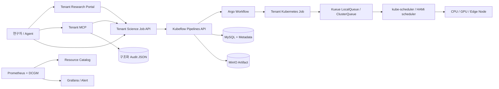

# Architecture

## 목표와 범위

`mini-science-ai-os` 0.3.1은 한 Kubernetes 클러스터 안의 `tenant-etri`만 내부 제품 실행 경계로 사용한다. 연구자와 Agent에는 Kubernetes API 대신 ETRI Science Job API를 제공한다. 실제 다기관 Kubernetes/SLURM 연동은 `SiteAdapter` 뒤의 향후 범위다.

## 책임 분리

| 구성요소 | 책임 | 보장하지 않는 것 |
|---|---|---|
| Science Job API | 입력/Registry/자원 상한 검증, Tenant 고정, KFP Run 제출·조회 | Cluster Admin, 임의 PodSpec |
| Tenant Research Portal | 동일 Tenant API의 Job/Queue/KFP/Metric/Artifact UI | 중앙 관리자 권한, 다른 Tenant 조회 |
| Kubeflow Pipelines 2.17.0 | Run DAG, 상태·Metric·Artifact·Metadata | Kueue Quota, GPU 성능 격리 |
| Kueue 0.17.3 | LocalQueue/ClusterQueue Quota와 입장/대기 | Node 선택 |
| kube-scheduler/HAMi | Node와 논리 GPU Memory/Core 할당 | 물리 성능 QoS |
| MinIO | KFP Artifact와 로그 객체 | 원격 DR |
| Resource Catalog | Kubernetes/HAMi/Prometheus 관찰값 집계 | Scheduling 결정 |
| MCP | Science API Tool과 Audit | Kubernetes 직접 호출 |

## Namespace

- `kubeflow`: KFP API/UI, Metadata, Argo Workflows, MySQL.
- `science-ai-mlops`: KFP Artifact용 MinIO.
- `science-ai-system`: Resource Catalog, Alert, 한국어 설명 사이트.
- `tenant-etri`: ETRI API, MCP, LocalQueue, Job, 제품 Ingress.
- `kueue-system`: Kueue가 기존에 없을 때 설치.
- `science-ai-build`: 비특권 Kaniko Build 전용.

KFP는 `pipeline-runner-etri` ServiceAccount로 `tenant-etri`에 제한된 Job만 생성한다. Science API의 `TENANT_NAMESPACE`는 Deployment 환경변수로 고정되어 요청자가 Namespace를 선택할 수 없다.

## Site Adapter

- `KubernetesSiteAdapter`: 현재 실제 구현.
- `SlurmSiteAdapter`: Interface와 Mock만 구현.
- `CloudSiteAdapter`: Interface만 정의.

실제 Federation, SLURM 제출, 데이터 위치 기반 Site Scheduling은 MVP 범위 밖이다.
