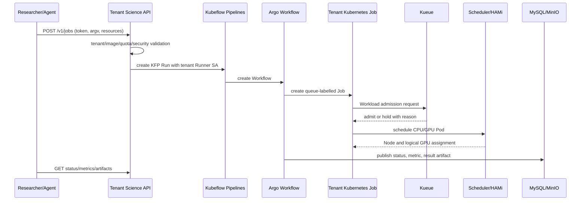

# User and operational flows

```mermaid
sequenceDiagram
    participant U as Researcher/Agent
    participant A as Tenant Science API
    participant P as Kubeflow Pipelines
    participant W as Argo Workflow
    participant K as Tenant Kubernetes Job
    participant Q as Kueue
    participant S as Scheduler/HAMi
    participant O as MySQL/MinIO
    U->>A: POST /v1/jobs (token, argv, resources)
    A->>A: tenant/image/quota/security validation
    A->>P: create KFP Run with tenant Runner SA
    P->>W: create Workflow
    W->>K: create queue-labelled Job
    K->>Q: Workload admission request
    Q-->>K: admit or hold with reason
    K->>S: schedule CPU/GPU Pod
    S-->>K: Node and logical GPU assignment
    W->>O: publish status, metric, result artifact
    U->>A: GET status/metrics/artifacts
```

MCP Tool은 Tenant Science API만 호출하고 `request_id`, `tenant`, `tool_name`, 마스킹된 인자, 권한 결정, 연결 Job ID, 결과/오류를 구조화 JSON으로 남긴다.
