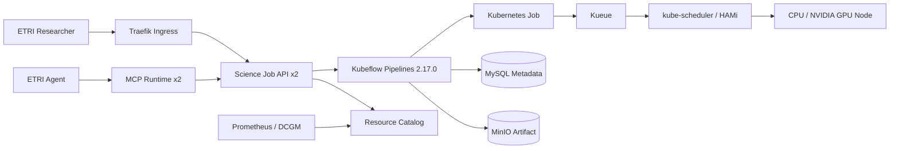

# Product architecture

## Product

NAIS Science Workspace 0.3.1은 ETRI 연구자가 Kubernetes Manifest 없이 CPU/GPU Science Job을 제출하고 Kueue, Kubeflow, Metric, Artifact를 한 화면에서 추적하는 내부 운영 제품이다. 제품 실행 범위는 `tenant-etri` 하나다.

## Stack and execution path

The browser receives an ETRI-scoped HMAC-signed HttpOnly cookie from the same API origin. It never receives the API token. Direct API and MCP calls use `tenant-etri/tenant-api-token`. Tenant scope is derived from Deployment configuration, never request input.

## Trust boundaries

- Browser → Traefik/API: `192.168.0.0/24` trusted network, SameSite cookie and Origin check. 내부망 자체가 승인된 사용자 경계다.
- API → Kubeflow: fixed KFP endpoint and `pipeline-runner-etri`; callers cannot select a ServiceAccount or Namespace.
- Kubeflow → `tenant-etri`: Namespace Role limits Job/Pod/Workload operations.
- MCP → API: HTTP only; MCP Pod has no Kubernetes credential.
- Job → Node: non-root, no privilege escalation, RuntimeDefault seccomp, no host namespaces/hostPath, no ServiceAccount token.

## Known risks and assumptions

- `PORTAL_ACCESS_MODE=trusted-network` means Ingress Allowlist를 통과한 내부 사용자는 ETRI 포털 권한을 갖는다 (`tenants/base/services.yaml`).
- 제품 Ingress는 내부 HTTP다. 사용자별 Identity가 필요해지면 TLS/OIDC로 확장한다 (`tenants/etri/product.yaml`).
- Flannel is present without an observed enforcing policy controller; NetworkPolicy objects exist but enforcement is BLOCKED (`scripts/test.sh`).
- MySQL and MinIO use `local-path` PVCs and are not highly available or externally backed up (`apps/mlops`, `apps/kubeflow/runtime`).
- API and MCP have two replicas/PDBs, but Kubeflow Metadata and Artifact dependencies remain single-instance.
- HAMi quotas are scheduling controls, not physical GPU performance isolation.
- Argo CD Applications cannot sync until this workspace is published to a Git repository.

No email delivery, public SEO surface, or scheduled/Cron work exists, so there are no `emails.md`, `seo.md`, or `cron.md` artifacts.

## Related documents

- [flows.md](flows.md)
- [permissions.md](permissions.md)
- [variables.md](variables.md)
- [tests.md](tests.md)
- [automation.md](automation.md)
- Engineering runbook: `docs/runbook.md`
- Threat model: `docs/threat-model.md`
- Evidence: `docs/evidence/`
